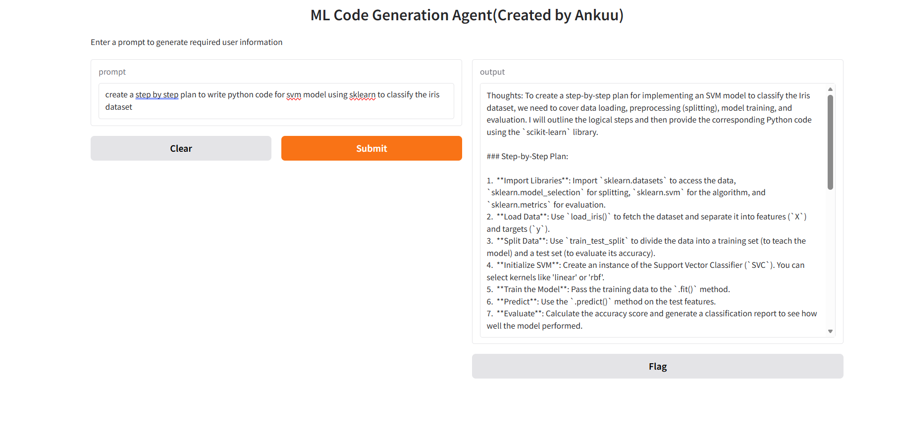
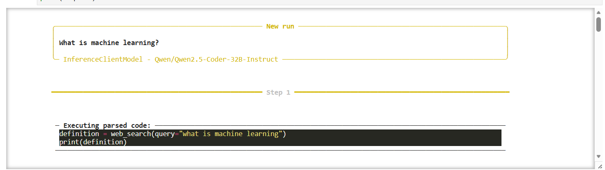
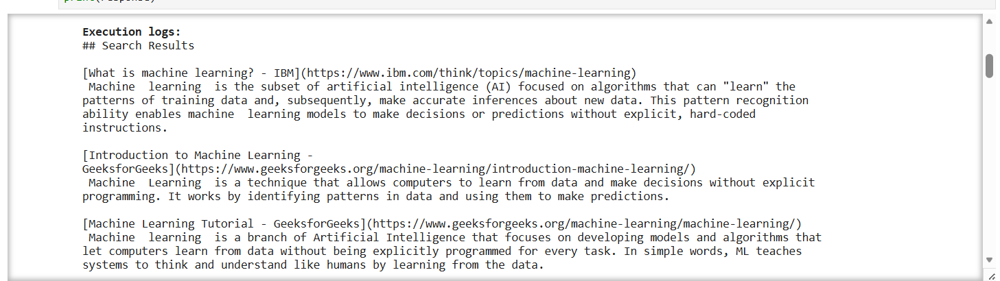
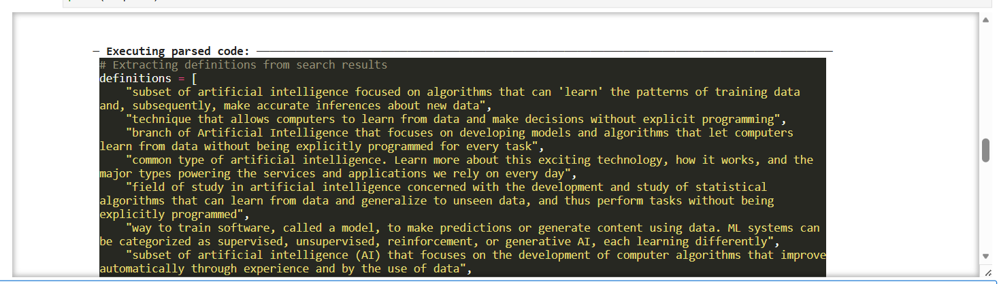

# 🤖 SmolAgents & WebSearchTool

An AI Agent project built using **SmolAgents**, **Hugging Face**, and **WebSearchTool**.  
This project demonstrates how AI agents can use language models and tools to answer questions and search the web.

---

## 🚀 Project Overview

This project contains two implementations:

### 🤖 SmolAgents
An AI agent created using `CodeAgent` and a Hugging Face inference model.

### 🔎 WebSearchTool
An agent that uses `WebSearchTool` to search the web and retrieve information.

---

## 🛠️ Technologies Used

- Python
- SmolAgents
- Hugging Face
- WebSearchTool
- Gemini API
- Jupyter Notebook

---

# 📊 Output / Results

## 🤖 SmolAgents

The SmolAgents notebook successfully initializes the agent and processes the user query.

### Output



---

## 🔎 WebSearchTool

The WebSearchTool notebook demonstrates web searching through the AI agent.

### Output 1



### Output 2



### Output 3



---

# 📂 Project Structure

```text
smolagents-websearch-agent/
│
├── smolagents.ipynb
├── websearchtool.ipynb
│
├── Output/
│   ├── Output1.png
│   ├── Output2.png
│   ├── Output3.png
│   └── smolagents.png
│
├── .gitignore
|──  requirements.txt
├── .env.example
└── README.md
